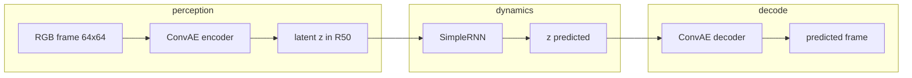
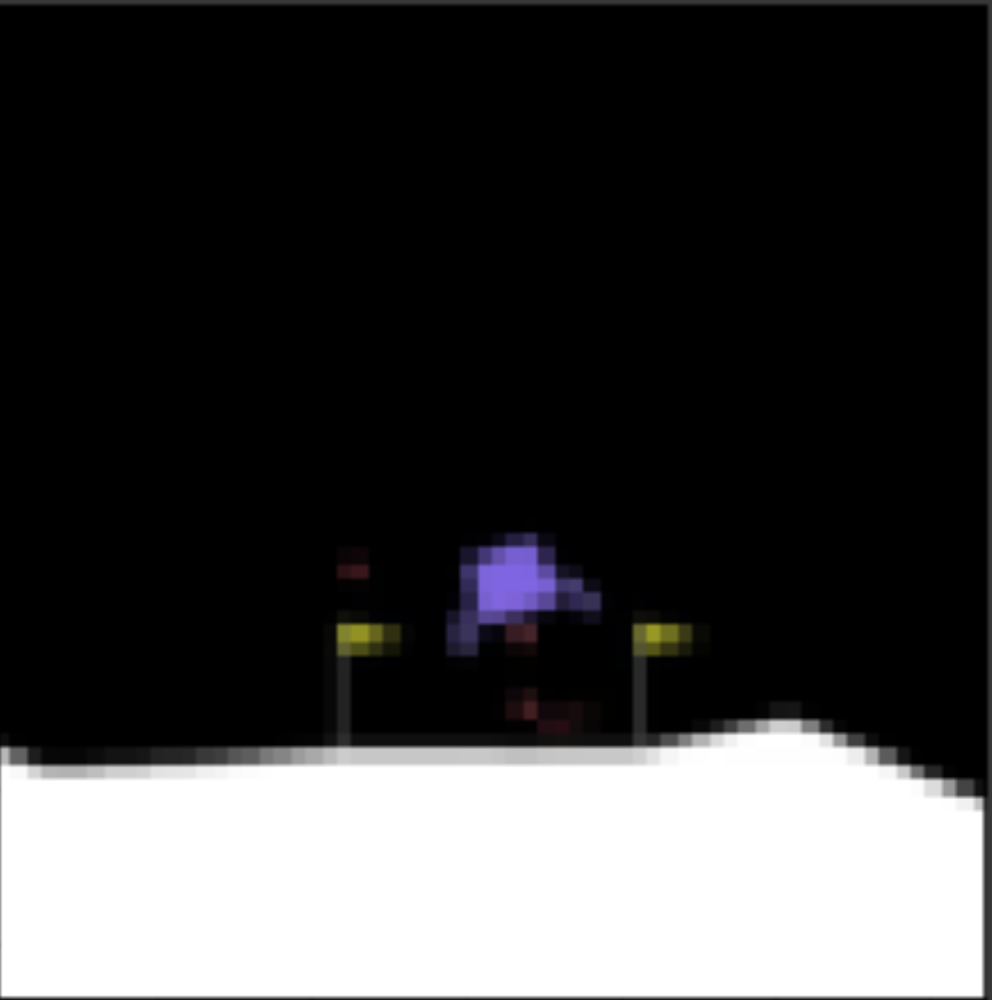
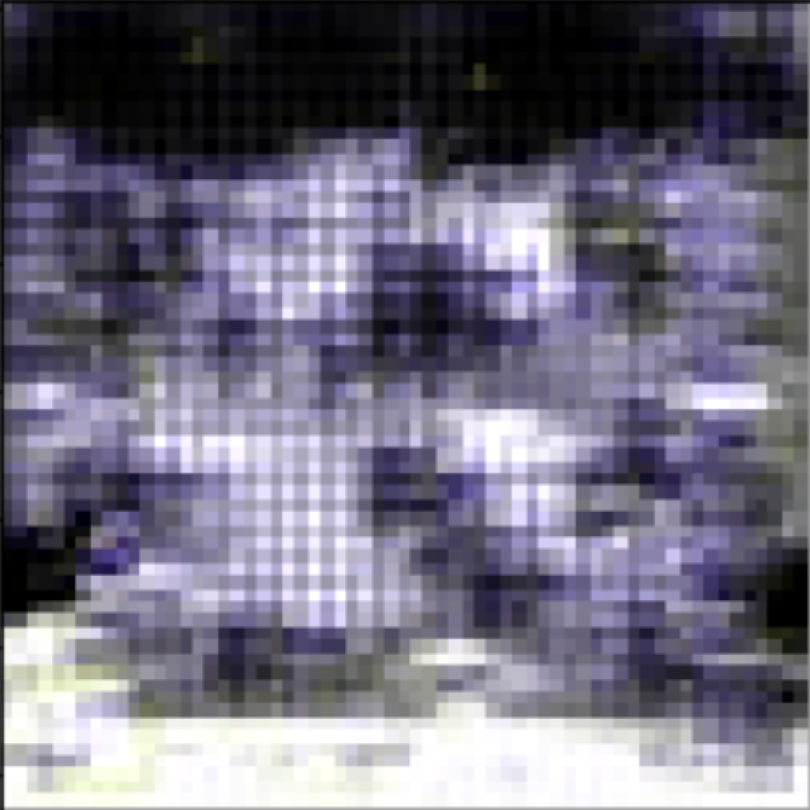
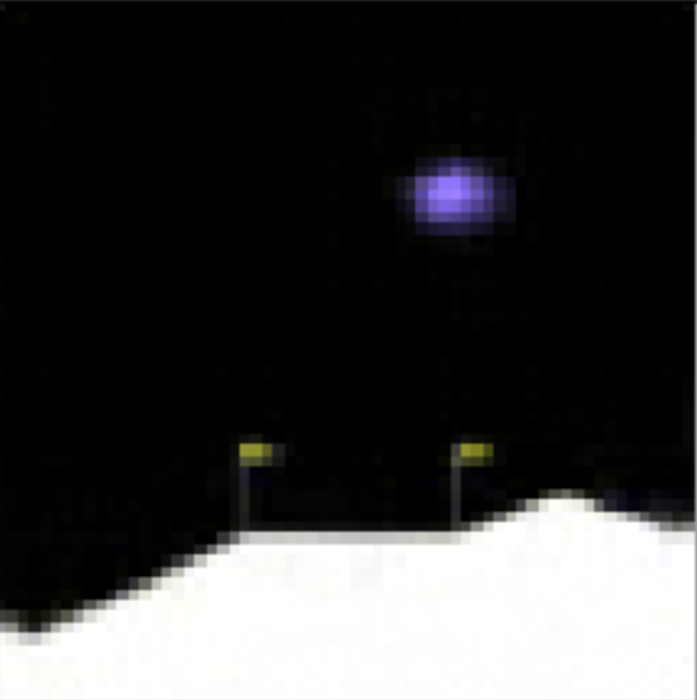

# Lunar Lander Trajectory Predictor (LLTP)

*PyTorch · Gymnasium (LunarLander-v3) · latent ConvAE + RNN · [MIT](LICENSE)*

Predict the **next rendered frame** of [Gymnasium](https://gymnasium.farama.org/) **LunarLander-v3** (Box2D) after training on short episodes with **random actions**. A **convolutional autoencoder (ConvAE)** compresses each RGB frame to a **50-dimensional latent vector**; a small **recurrent network** steps the latent forward one timestep; the decoder maps the predicted latent back to an image.

**Status:** Research / educational codebase — reproducible install, library-style modules, and tests for core components. Full training is more comfortable on a GPU; CPU suffices for smoke tests and the training CLI.

**Maintenance:** Feature-complete; no planned active development except clear breakages (e.g. upstream API or dependency issues).

---

## Why it matters

Model-based rollouts in latent space are a standard way to approximate environment dynamics without predicting pixels in raw high resolution. This project is a minimal, interpretable instance: Box2D physics + random policy → frame pairs → ConvAE + RNN in latent space.

---

## Features

- **ConvAE** on **64×64** RGB (resize + center crop from environment frames).
- **Latent RNN** (50 → 200 hidden units → 50) trained to map encoded current state toward encoded next frame.
- **Frame dataset** loader for `Train/<episode>/frameN.jpg` style layouts (same convention as the historical notebook).
- **Data collection script** using **Gymnasium** and `rgb_array` rendering (no ffmpeg/OpenCV pipeline).
- **`train_autoencoder.py`** — minimal CLI for ConvAE training (PIL preprocessing; no torchvision required).
- **Unit tests** for tensor shapes, dataset pairing, and RNN loop semantics.

---

## Architecture



1. **Preprocessing:** resize/crop to 64×64, tensor in channel-first form.
2. **Autoencoder:** trained with MSE reconstruction (see `src/lltp/models.py`).
3. **RNN:** trained on latent pairs `(z_t, z_{t+1})` with MSE; notebook historically used **batch size 1** and iterated the batch dimension as a single time step (preserved in `training.rnn_train_step` for compatibility).

---

## Repository layout

| Path | Purpose |
|------|---------|
| `src/lltp/` | `ConvAE`, `SimpleRNN`, `FrameSequenceDataset`, training helpers |
| `scripts/collect_episode_frames.py` | Record episodes as JPEG sequences |
| `scripts/train_autoencoder.py` | Train ConvAE on collected frames |
| `notebooks/LunarLander_Trajectory_Predictor.ipynb` | Original Colab-oriented walkthrough (cleaned outputs; Linux/Colab cells retained) |
| `tests/` | PyTest suite (no Box2D required) |
| `assets/figures/` | Example result images (bundled for offline README; see attribution below) |

---

## Setup

**Requirements:** Python **3.10+**, [PyTorch](https://pytorch.org/) matching your platform (CPU or CUDA).

From the repository root:

```bash
# Core package + tests
pip install -e ".[dev]"

# Optional: Gymnasium + Box2D + OpenCV for data collection
pip install -e ".[gym,dev]"
```

**Box2D / LunarLander:** on some systems you may need build tools or [Gymnasium Box2D install notes](https://gymnasium.farama.org/environments/box2d/lunar_lander/). Recent Gymnasium versions deprecate `LunarLander-v2`; this repo defaults to **`LunarLander-v3`** in the collection script.

**Windows / PowerShell:** if `pytest` is not on `PATH`, use `python -m pytest`.

---

## Quickstart

```bash
# 1) Collect episodes (writes Train/0, Train/1, …)
python scripts/collect_episode_frames.py --out Train --episodes 10

# 2) Train ConvAE (writes checkpoints/convae.pt by default)
python scripts/train_autoencoder.py --data Train --epochs 5 --device cpu

# 3) Run tests
python -m pytest -q
```

The notebook and snippets that use `torchvision.transforms` still work after `pip install -e ".[notebook]"` (or `pip install torchvision`):

```python
from lltp import ConvAE, SimpleRNN
from lltp.dataset import FrameSequenceDataset
from torchvision import transforms

preprocess = transforms.Compose([
    transforms.Resize(64),
    transforms.CenterCrop(64),
    transforms.ToTensor(),
])
ds = FrameSequenceDataset("Train/", transform=preprocess)
```

---

## Results

Example visuals below match the **original public LLTP figures** (same architecture and task). They are stored under `assets/figures/` so the README renders without hotlinking; **attribution:** images were published in [AmirMohaddesi/LLTP](https://github.com/AmirMohaddesi/LLTP) under that project’s terms.

| AE reconstruction vs input | Decoded random latent | Next-frame latent rollout (example) |
|----------------------------|------------------------|-------------------------------------|
|  |  |  |

Training your own model will change pixel-level appearance; use this section to show **your** checkpoints only if you replace images and caption them honestly.

---

## Limitations

- **Random policy data** — no imitation of a trained lander; predictions drift under repeated latent rollout (see multi-step figures in the reference project).
- **Notebook vs library** — the notebook still uses classic `gym`/`!apt-get` on Colab; local collection uses **Gymnasium** (`LunarLander-v3` by default).
- **RNN training semantics** — matches the historical notebook (batch dimension used as a single-step loop); not a general sequence batch trainer.
- **No pretrained weights** in this repository — you train from scratch or supply your own checkpoint.

---

## Roadmap (suggested)

- **Gymnasium** migration inside the notebook for a single stack.
- Optional **RNN training CLI** mirroring the notebook loop.
- **Pretrained** weights only if you can host them with a clear license.

---

## Development

```bash
make install      # pip install -e ".[dev]"
make test         # pytest -q
```

Continuous integration (`.github/workflows/ci.yml`) installs **`[dev]`** only and runs **pytest** — same as a local CPU checkout without Box2D.

---

## Citation / lineage

Educational trajectory-prediction experiment with ConvAE + RNN in latent space on Lunar Lander. If you reuse this repository, cite or link the repository you fork and any publication you associate with your own work.

---

## License

This project is licensed under the MIT License — see [LICENSE](LICENSE).
